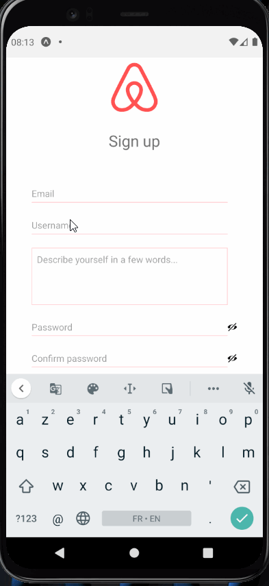

<div align="center" id="top"> 
  

  &#xa0;

  <!-- <a href="https://airbnbbackend.netlify.app">Demo</a> -->
</div>

<h1 align="center">Clone Airbnb - REACT NATIVE</h1>

<p align="center">
  

  

  

  

  <!--  -->

  <!--  -->

  <!--  -->
</p>

<!-- Status -->

<!-- <h4 align="center"> 
	🚧  Airbnb Backend 🚀 Under construction...  🚧
</h4> 

<hr> -->

<p align="center">
  <a href="#dart-about">About</a> &#xa0; | &#xa0; 
  <a href="#img-screenshots">Screenshots</a> &#xa0; | &#xa0; 
  <a href="#sparkles-features">Features</a> &#xa0; | &#xa0;
  <a href="#rocket-technologies">Technologies</a> &#xa0; | &#xa0;
  <a href="#white_check_mark-requirements">Requirements</a> &#xa0; | &#xa0;
  <a href="#checkered_flag-starting">Starting</a> &#xa0; | &#xa0;
  <a href="#memo-license">License</a> &#xa0; | &#xa0;
  <a href="https://github.com/BruceLIOU" target="_blank">Author</a>
</p>

<br>

## :dart: About ##

Clone Airbnb create with REACT NATIVE

## 📷[!img-screenshots] Screenshots ##

<p align="center">


    
    
</p>

<br>

## :sparkles: Features ##

:heavy_check_mark: Feature 1;\
Sign up;\
:heavy_check_mark: Feature 2;\
Sign in:\
:heavy_check_mark: Feature 3;\
Home:\
:heavy_check_mark: Feature 3;\
Rooms & Room/id:\
// TODO components (logo/input/btn/stars)

## :rocket: Technologies ##

The following tools were used in this project:

- [React Navigation](https://reactnavigation.org/)
- [KeyboardAwareScrollView](https://github.com/APSL/react-native-keyboard-aware-scroll-view)
- [React](https://pt-br.reactjs.org/)
- [Axios](https://github.com/axios/axios)

## :white_check_mark: Requirements ##

Before starting :checkered_flag:, you need to have [Git](https://git-scm.com) and [Node](https://nodejs.org/en/) installed.

## :checkered_flag: Starting ##

## Warning
This project works pretty fine only for Android...As soon have buy an Mac 😃

```bash
# Clone this project
$ git clone https://github.com/BruceLIOU/le-reacteur-RN-clone-Rbnb

# Access
$ cd le-reacteur-RN-clone-Rbnb

# Install dependencies
$ yarn or npm

# Run the project
$ yarn start or expo start

# The server will initialize in the <http://localhost:3001>
```

## :memo: License ##

This project is under license from MIT. For more details, see the [LICENSE](LICENSE.md) file.


Made with :heart: by <a href="https://github.com/BruceLIOU" target="_blank">Bruce LIOU</a>

&#xa0;

<a href="#top">Back to top</a>
